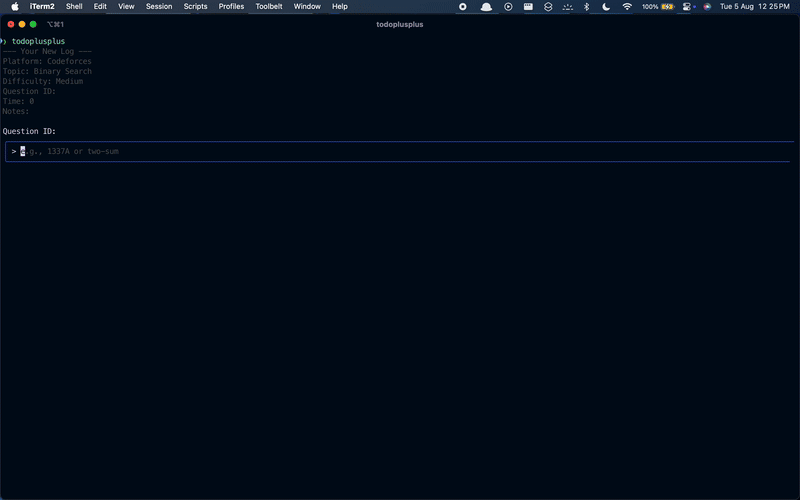

# todoplusplus 🚀

Tired of clunky spreadsheets or plain text files to track your competitive programming grind?  
**`todoplusplus`** is a **blazingly fast, terminal-based application** built in **Go**, designed to manage your entire CP journey without ever leaving the keyboard.

It’s **local-first**, powerful, and integrates with the tools you already use.

---

## 🎥 Demo

> 

---

## ✨ Features

- 💻 **Sleek Terminal UI**  
  A fast, multi-view terminal interface for all your actions, built with the powerful **Bubbletea** framework.

- 💾 **Local-First Database**  
  All your data is stored securely and instantly on your own machine in an embedded **BoltDB** database.  
  _No cloud dependency_ for your core data.

- ⚙️ **Full CRUD Functionality**  
  Add, view, edit, and delete your problem logs with a seamless, intuitive workflow.

- 🔍 **Real-time Filtering**  
  Instantly search through hundreds of logs by **Question ID**, **Platform**, **Topic**, or **Difficulty** in the "View Logs" screen.

- 🗓️ **Google Calendar Sync**  
  Automatically creates and deletes corresponding events on your **Google Calendar** for every log entry — giving you a powerful visual overview of your consistency.

- 📧 **Smart Email Reminders**  
  A background service can be configured to send a **fun, randomized reminder via Gmail API** on days you forget to practice.

- 📦 **Automated Backups**  
  Your database is automatically backed up periodically, with smart rotation to save the **last 150 copies**, ensuring your data is always safe.

- 📄 **Excel Export**  
  Export all your logs to a clean **.xlsx spreadsheet** with a single command.

---

## 🛠️ Installation

### macOS / Linux (via Homebrew)

This is the **recommended method** for macOS and Linux users:

```bash
brew tap Harschmann/homebrew-tap
brew install todoplusplus
```

To upgrade in the future:

```bash
brew upgrade todoplusplus
```

### Windows / Other Systems (via GitHub Releases)

1. Go to the [Releases](https://github.com/Harschmann/todoplusplus/releases) page.
2. Download the latest `.zip` (Windows) or `.tar.gz` (Linux) for your system’s architecture (usually `amd64`).
3. Unzip and place the `todoplusplus` executable in your system's `PATH`.

---

## 🚀 Usage

### Launch the Main TUI

```bash
todoplusplus
```

### Export Logs to Excel

```bash
todoplusplus --export
```

### Manually Trigger Reminder (For Testing)

```bash
todoplusplus --reminder
```

---

## 🔑 First-Time Login with Google

1. When you first run `todoplusplus`, it will prompt a **Google OAuth setup**.
2. Copy the URL printed in your terminal and open it in your browser.
3. Sign in and grant the required permissions.
4. After success, your browser will show a _“site can’t be reached”_ error. This is expected!
5. In your browser’s address bar, locate the part that says:

```
code=4/0AVMBs...&scope=...
```

6. Copy the value between `code=` and the `&`.
7. Paste it back into your terminal and press Enter.

✅ This is a **one-time setup**. Your token will be securely saved and reused.

---

## 🤖 Setting Up Automated Reminders (Optional)

### macOS & Linux (Using `cron`)

1. Open terminal and run:

```bash
crontab -e
```

2. Press `i` to enter insert mode and add the following line:

```cron
# Send a CP reminder every day at 8 PM
0 20 * * * /path/to/your/app/todoplusplus --reminder
```

> If installed via Homebrew, just use `todoplusplus` instead of the full path.

3. Press `Esc`, type `:wq`, and press Enter to save.

---

### 🪟 Windows (Using Task Scheduler)

To set up automatic email reminders on Windows:

1. **Open Task Scheduler**  
   Press `Win + S` and search for **Task Scheduler**, then open it.

2. **Create a New Basic Task**  
   In the right-hand panel, click **Create Basic Task...**

3. **Set Name and Description**  
   - **Name**: `todoplusplus Daily Reminder`  
   - (Optional) Add a description like: _"Send daily CP reminder email"_

4. **Set the Trigger**  
   - Choose **Daily**
   - Set the time to **8:00:00 PM**
   - Click **Next**

5. **Set the Action**  
   - Choose **Start a program**
   - Click **Next**

6. **Configure the Program**  
   - **Program/script**: Click **Browse** and select your `todoplusplus.exe` file  
   - **Add arguments (optional)**:  
     ```
     --reminder
     ```
   - Click **Next**

7. **Finish**  
   Review the settings and click **Finish**

✅ Windows will now run `todoplusplus --reminder` every day at 8 PM automatically.

---

## 👨‍💻 For Developers (Build from Source)

Want to contribute? Here's how to build it locally:

```bash
git clone https://github.com/Harschmann/todoplusplus.git
cd todoplusplus

# Build the binary
go build -o todoplusplus ./cmd/todoplusplus

# Run the app
./todoplusplus
```

---

## 🔧 Tech Stack

| Component         | Technology                          |
|------------------|--------------------------------------|
| Language          | Go                                   |
| Terminal UI       | [Bubbletea](https://github.com/charmbracelet/bubbletea), [Lipgloss](https://github.com/charmbracelet/lipgloss) |
| Database          | [BoltDB](https://github.com/etcd-io/bbolt) (embedded key-value store) |
| Concurrency       | Goroutines, Tickers                  |
| API Integration   | Google Calendar API, Gmail API (OAuth 2.0) |
| Release Automation| GoReleaser, Homebrew Tap             |

---

Built with ❤️ by [@Harschmann](https://github.com/Harschmann)
